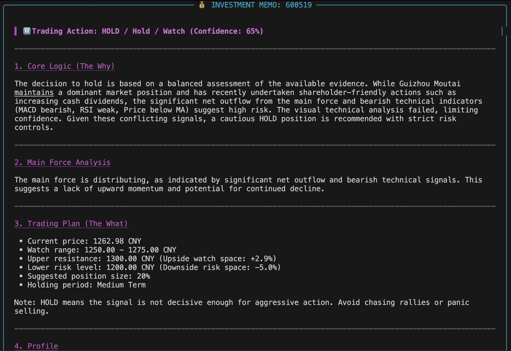

# A-Stock Agent



A-Stock Agent is a LangGraph-based command-line investment research assistant for Chinese A-share stocks.

Given a 6-digit A-share stock code, the system collects market data, money-flow data, company profile information, candlestick charts, short-term forecasts, and recent news. It then runs a multi-agent workflow to produce a structured investment memo with a final `BUY`, `SELL`, or `HOLD` decision.

> This project is for research and educational purposes only. It is not financial advice. Always verify data independently and make investment decisions based on your own risk tolerance.

## Features

- A-share stock code normalization, including formats such as `600519`, `sh600519`, and `600519.SH`.
- Historical price data from AkShare, with BaoStock fallback.
- Technical indicators including RSI, MACD, MACD signal, MACD histogram, and moving averages.
- Candlestick chart generation with price, volume, moving averages, and MACD.
- Short-term price trend forecasting with Prophet.
- Individual stock money-flow analysis through AkShare.
- Company profile lookup through AkShare and BaoStock fallback sources.
- Recent news and sentiment research through Tavily.
- Visual chart analysis through ZhipuAI GLM-4V.
- Multi-agent LangGraph workflow:
  - Fetcher
  - Quant Analyst
  - Visual Analyst
  - News Analyst
  - Bull Researcher
  - Bear Researcher
  - Risk Manager
  - CIO
- Bull / bear debate and risk-control review before the final CIO decision.
- Structured Pydantic outputs for stable agent responses.
- Bilingual output support through `APP_LANGUAGE=cn` or `APP_LANGUAGE=en`.
- Rich terminal rendering for readable investment memos.

## How It Works

The current workflow is:

```text
User enters stock code
        |
        v
Fetcher
  - price data
  - chart image
  - Prophet forecast
  - news
  - money flow
  - company profile
        |
        v
Parallel analysis
  - Quant Agent
  - Visual Agent
  - News Agent
        |
        v
Debate and risk review
  - Bull Researcher builds the strongest buy/hold case
  - Bear Researcher challenges the bull case
  - Risk Manager judges the debate and sets a confidence cap
        |
        v
CIO
  - final BUY / SELL / HOLD decision
  - confidence
  - entry or exit range
  - target price
  - stop-loss level
  - suggested position size
  - risk warning
```

## Main Dependencies

The project requires Python 3.11 or later.

Core packages:

- `langgraph` - multi-agent workflow orchestration
- `langchain` and `langchain-openai` - LLM integration and structured output
- `akshare` - A-share market data, money flow, and company profile data
- `baostock` - fallback A-share market and profile data
- `pandas` - data processing
- `ta` - technical indicators
- `mplfinance` - candlestick chart generation
- `prophet` - short-term time-series forecasting
- `tavily-python` - news search
- `zhipuai` - GLM-4V visual chart analysis
- `rich` - terminal UI
- `python-dotenv` - environment variable loading

See [pyproject.toml](./pyproject.toml) for the exact dependency list.

## Project Structure

```text
.
├── main.py                 # CLI entry point
├── pyproject.toml          # project metadata and dependencies
├── uv.lock                 # uv lock file
├── .env.example            # environment variable template
├── src/
│   ├── agents.py           # prompts and VisualAgent
│   ├── graph.py            # LangGraph workflow
│   ├── models.py           # Pydantic output models and report rendering
│   ├── settings.py         # shared runtime settings
│   └── tools.py            # data, chart, forecast, profile, and news tools
└── temp_charts/            # generated chart images, ignored by git
```

## Prerequisites

You need:

1. Python 3.11 or later.
2. A package manager. This project uses `uv`.
3. API keys for the external services you want to enable.

Required for core LLM reasoning:

- `OPENAI_API_KEY`
- `OPENAI_BASE_URL`
- `OPENAI_MODEL_NAME`

Optional but recommended:

- `ZHIPUAI_API_KEY` for visual chart analysis.
- `TAVILY_API_KEY` for recent news search.
- `AKSHARE_PROXY_PATCH_*` settings if your AkShare Eastmoney requests are unstable.

The OpenAI-compatible configuration can point to OpenRouter or any compatible endpoint.

## Installation

Clone the repository:

```bash
git clone https://github.com/nowfuture011130/a-stock-agent.git
cd a-stock-agent
```

Install dependencies with `uv`:

```bash
uv sync
```

If you do not have `uv` installed, install it first:

```bash
curl -LsSf https://astral.sh/uv/install.sh | sh
```

Then restart your terminal and run:

```bash
uv sync
```

## Environment Setup

Copy the environment template:

```bash
cp .env.example .env
```

Open `.env` and fill in your real API keys:

```env
APP_LANGUAGE=cn

OPENAI_API_KEY=your_openai_compatible_api_key
OPENAI_BASE_URL=https://openrouter.ai/api/v1
OPENAI_MODEL_NAME=deepseek/deepseek-chat

ZHIPUAI_API_KEY=your_zhipuai_api_key
TAVILY_API_KEY=your_tavily_api_key

AKSHARE_PROXY_PATCH_ENABLED=true
AKSHARE_PROXY_PATCH_TOKEN=your_token
AKSHARE_PROXY_PATCH_HOST=101.201.173.125
AKSHARE_PROXY_PATCH_RETRY=30
```

### Language Option

The app supports two output languages:

```env
APP_LANGUAGE=cn
```

Chinese output. This is the default.

```env
APP_LANGUAGE=en
```

English output. This changes the CLI progress messages, final memo labels, and LLM narrative fields.

## Running the App

Start the CLI:

```bash
uv run python main.py
```

You will see a prompt like:

```text
Enter Stock Code (e.g., 600519 or q to quit)
```

Enter a 6-digit A-share code:

```text
600519
```

The app will run the full workflow and produce an investment memo.

You can also use codes such as:

```text
000001
300750
sh600519
sz000001
600519.SH
000001.SZ
```

To exit:

```text
q
```

or:

```text
quit
```

## Example Output

The final memo contains:

- Trading action: `BUY`, `SELL`, or `HOLD`
- Confidence score
- Core decision logic
- Main force / money-flow analysis
- Suggested entry, exit, or watch range
- Target price
- Stop-loss or risk level
- Expected upside and downside risk
- Suggested position size
- Holding period
- Company profile
- Risk warning

## Notes on Data Reliability

This project depends on multiple external data sources. A-share data APIs may fail, change format, rate limit, or return incomplete data.

The workflow is designed to degrade gracefully:

- If AkShare price data fails, BaoStock is used as fallback.
- If money-flow data fails, the Quant Agent is instructed to lower confidence.
- If news search fails or news dates are unknown, the News Agent must treat the evidence as weak.
- If visual analysis fails, the CIO is expected to reduce confidence.
- The Risk Manager sets a confidence cap when evidence is incomplete or conflicting.

You should still manually verify:

- latest price data
- company announcements
- financial reports
- major shareholder actions
- regulatory events
- liquidity and trading volume

## Common Issues

### `OPENAI_API_KEY is missing`

Create `.env` from `.env.example` and fill in `OPENAI_API_KEY`.

### Visual Agent fails

Check `ZHIPUAI_API_KEY`. If it is missing, the workflow can continue, but chart-image analysis will be unavailable.

### News Agent fails

Check `TAVILY_API_KEY`. Without it, recent news search will be unavailable.

### AkShare data fails

Some AkShare endpoints can be unstable. You can:

- retry later
- enable `akshare-proxy-patch`
- rely on BaoStock fallback for historical price data

### Prophet installation or runtime issues

Prophet depends on CmdStanPy. If forecast execution fails, the workflow should continue with a warning, but the Quant Agent will have weaker trend evidence.

## Development

Run a syntax check:

```bash
python -m compileall main.py src
```

Run with the project environment:

```bash
uv run python main.py
```

Check git status:

```bash
git status
```

## Security

Never commit `.env` or real API keys.

This repository includes `.gitignore` rules for:

- `.env`
- virtual environments
- Python caches
- generated chart images
- local OS and IDE files

Only `.env.example` should be committed.

## Disclaimer

This project does not provide financial advice. The generated reports may be wrong, incomplete, outdated, or based on failed data sources. Use the output as a research aid only, not as a trading instruction.
